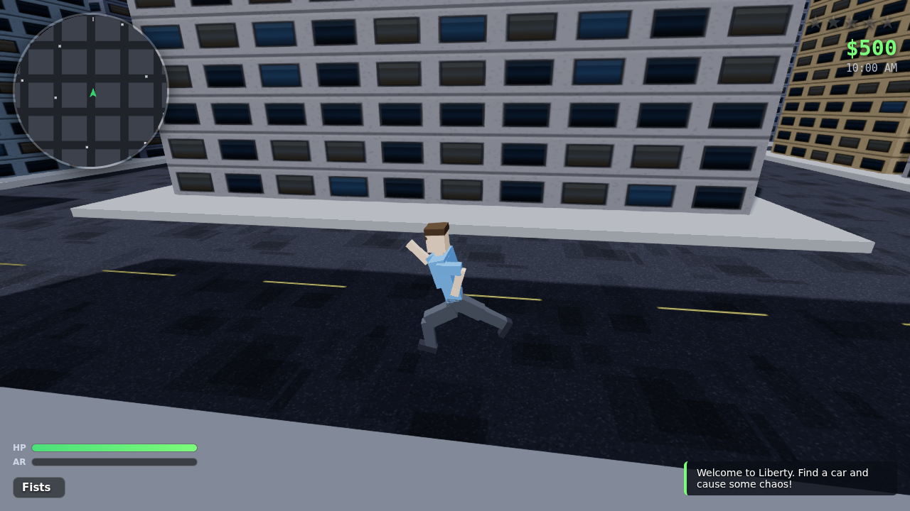
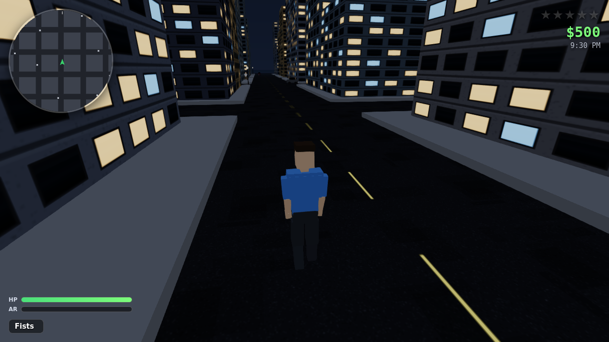

# 🌆 LIBERTY DRIVE

A **GTA-style open-world sandbox game** that runs entirely in your browser. Steal
cars, tear through a living city, rack up a wanted level, outrun the cops, and pull
paid delivery jobs — all rendered in real-time 3D with **Three.js**.

No installs, no build step, no external downloads at runtime. Just open
`index.html` and play.



---

## ▶️ How to play

Open the game in a browser:

```bash
# from the project root, start any static server, e.g.:
python3 -m http.server 8000
# then visit http://localhost:8000
```

Or simply double-click **`index.html`** (opening via a local server is recommended
so the browser doesn't restrict local file access).

Click **ENTER THE CITY**, then click the screen to lock the mouse and go.

### Controls

| On foot | | In a vehicle | |
|---|---|---|---|
| **WASD** | Move | **W / S** | Gas / Brake–Reverse |
| **Mouse** | Look around | **A / D** | Steer |
| **Shift** | Sprint | **Space** | Handbrake |
| **Space** | Jump | **F** | Exit vehicle |
| **F** | Enter / steal a vehicle | **Mouse** | Look around |
| **Left Click** | Punch / Shoot | | |
| **1 / 2** | Fists / Pistol | | |
| **M** | Pause / menu | **Esc** | Release mouse |

---

## 🎮 Features

- **Procedural open-world city** — a full road grid with intersections, sidewalks,
  parks, and hundreds of windowed skyscrapers, generated fresh each session.
- **Drive-anywhere vehicles** — sedans, sports cars, trucks and police cruisers,
  each with distinct arcade handling. Enter, exit, and **jack any car** on the street.
- **A living city** — AI traffic that follows the roads and brakes for you, plus
  crowds of pedestrians that wander, panic, and flee from gunfire.
- **Wanted system** — commit crimes to raise your ⭐ level (1–5). Cops chase on foot
  and in cruisers, open fire, and try to bust you. Lose them and the heat cools off.
- **Combat** — fists and a pistol with hitscan shooting, muzzle flashes, tracers,
  blood and spark effects, and exploding vehicles.
- **WASTED / BUSTED** — die or get arrested and respawn at the hospital/police
  station for a fee, GTA-style.
- **Missions & economy** — hit yellow markers for timed delivery jobs that pay cash.
- **Full HUD** — health & armor bars, wanted stars, money, weapon/ammo, an in-car
  speedometer, and a **live rotating minimap** showing roads, cars, cops and objectives.
- **Day/night cycle** — the sun arcs across the sky, dusk glows orange, and at night
  every window and street lamp lights up.
- **Synthesized audio** — engine, gunshots, punches, crashes, cash, and a police
  siren, all generated live with the Web Audio API (no sound files).

### Visuals

- **Physically-shaded rendering** — sRGB output with ACES filmic tone mapping,
  soft real-time sun shadows, and a shadow frustum that travels with you so a
  600-unit city still gets crisp contact shadows.
- **Bloom** — lit windows, headlights and police strobes glow after dark
  (`UnrealBloomPass`, dialled right down in daylight).
- **Gradient sky dome** that shifts through dawn, midday, golden hour and night.
- **Jointed characters** — hips → torso → chest → neck, two-segment arms and
  legs, so knees fold and elbows bend.
- **Procedural run cycle** — stride frequency and amplitude scale with speed,
  knees fold only backwards, the torso pitches forward into a sprint, and the
  shoulders counter-rotate against the hips. Separate idle, walk, sprint,
  airborne, punch and two-handed aiming poses.
- **Detailed vehicles** — semi-metallic paint, raked greenhouse, chrome rims,
  bumpers and emissive lights.



---

## 🤖 Watch it play itself (autoplay bot)

The repo ships an AI bot that plays the game on its own — it drives the same
keyboard and mouse events a human does, so it exercises the real input path.

```bash
npm install            # one-time: pulls playwright-core
npm run autoplay       # or: node bot/autoplay.js --seconds 170 --headed
```

It writes `runs/gameplay.webm`, periodic screenshots, and a `report.json`
scorecard. The bot runs in three phases:

| Phase | What it does |
|---|---|
| **commute** | Steals a parked car, routes over the road grid to job markers, completes paid deliveries |
| **chaos** | Gets out, draws the pistol, and starts trouble to build a wanted level |
| **escape** | Jacks a fresh car and runs for the intersection furthest from the police |

It navigates with a **BFS route search over the city's intersection graph**
(the same node graph the traffic AI uses) rather than driving straight at
objectives, plus stuck-detection that reverses out of corners.

A representative 170-second session:

```
earned        +$1,093      deliveries     1        peak wanted   ★★★★★
top speed     75 mph       cars stolen    2        deaths        1
distance      1,187 units  shots fired   45        runtime errors 0
```

## 🧱 Tech & assets

- **Engine:** [Three.js](https://threejs.org/) r128 (MIT), vendored locally in
  `lib/three.min.js` so the game is fully self-contained and works offline.
- **Assets:** Everything you see and hear is **generated procedurally in code** —
  geometry (boxes/cylinders/icosahedrons), canvas-drawn window & lane-line textures,
  and Web Audio synthesis. This freely-recreates the GTA look and feel without
  shipping any copyrighted art, models, or audio.
- **No dependencies** beyond Three.js. Pure vanilla JavaScript.

### Project structure

```
index.html          Entry point, HUD markup, script loading
bot/                Autoplay bot (brain.js = AI, autoplay.js = runner)
css/style.css       HUD, menus, and overlay styling
lib/three.min.js    Vendored Three.js (MIT)
lib/pp/             Vendored post-processing passes (bloom, FXAA)
js/
  utils.js          Math helpers, palettes
  input.js          Keyboard + pointer-lock mouse look
  audio.js          Web Audio synthesized SFX (engine, siren, guns…)
  world.js          City generation, road graph, collision, day/night
  character.js      Jointed humanoid rig + procedural run/idle/aim animation
  player.js         On-foot player controller & camera
  vehicles.js       Car factory, arcade physics, chase camera
  traffic.js        AI traffic + pedestrians
  weapons.js        Effects (fx) + fists/pistol combat
  police.js         Wanted level + cop AI (foot & cruisers)
  missions.js       Delivery job system + world markers
  hud.js            HUD updates + minimap rendering
  game.js           Renderer, main loop, state, crime/respawn logic
```

---

## ⚖️ A note on "GTA"

*Grand Theft Auto* is a trademark of Rockstar Games. This is an original,
independent homage inspired by the **genre** and mechanics of open-world crime
sandboxes. It ships **no assets from any GTA title** — all art and audio are
generated procedurally in this repository.

---

## 💡 Tips

- Steal a fast **sports car** and see how high you can push the speedometer.
- Fire your pistol in a crowd to instantly draw a wanted level, then try to escape.
- Kill a cop for extra ammo — but the heat spikes to 3 stars.
- Break line of sight and wait: your wanted level cools down over time.
- Chain delivery jobs for a steady income between the chaos.

Have fun out there. 🚗💨
